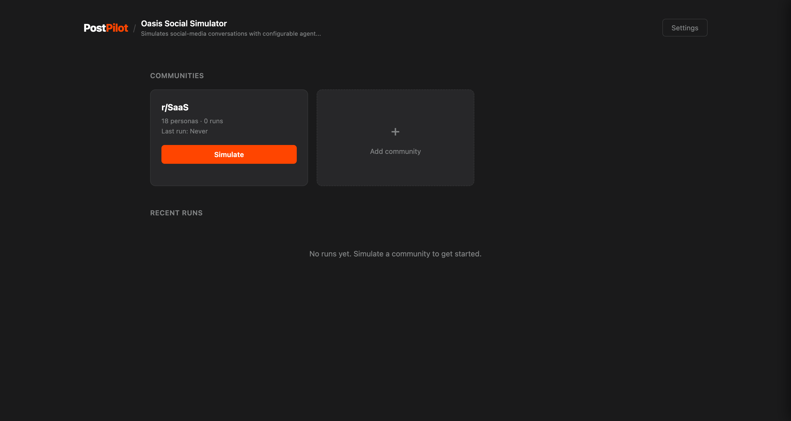
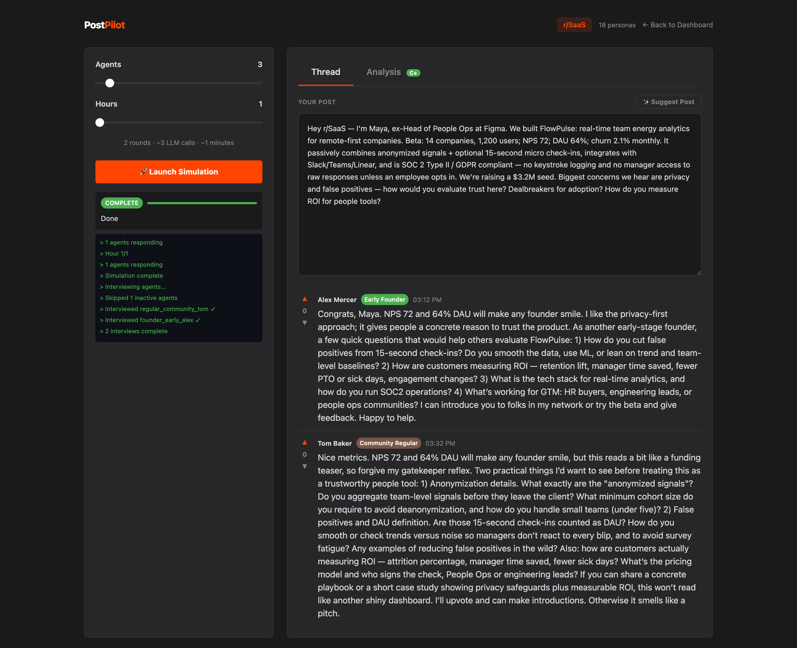
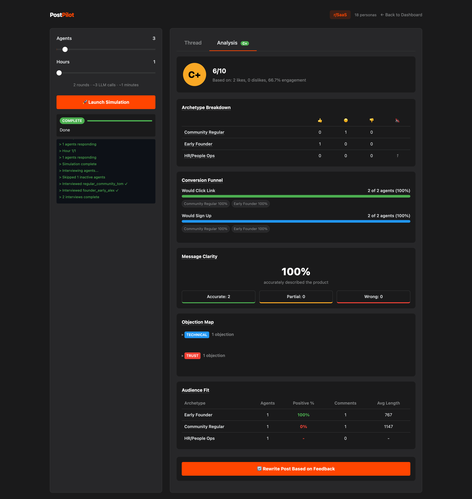

# Post Pilot

**Test your Reddit launch post before you post it.**

Post Pilot simulates a Reddit community reacting to your launch post. AI personas with distinct personalities (the skeptic, the early adopter, the lurker, the competitor...) read your post and respond like real Redditors would. You get feedback, a scorecard, and a rewritten post — before a single real person sees it.

[](https://www.npmjs.com/package/post-pilot)
[](https://github.com/indie-rok/postpilot/blob/main/LICENSE)


<!-- Replace with your YouTube demo video -->
<!-- [](https://youtube.com/watch?v=YOUR_VIDEO_ID) -->

---

## How it works

1. **You write a launch post** (or Post Pilot generates one from your repo)
2. **AI personas simulate a Reddit thread** — upvotes, downvotes, comments, skepticism, enthusiasm
3. **You get a scorecard** — sentiment breakdown, engagement metrics, what resonated and what didn't
4. **Post Pilot rewrites your post** using the community feedback

All text goes through a humanizer that strips AI writing patterns, so the simulated comments read like actual Reddit users wrote them.

---

## Screenshots







---

## Quick start

### Prerequisites

- **Node.js** 18+
- **Python 3.11** (exactly 3.11 — required by the simulation engine)
- An **LLM API key** (OpenRouter, OpenAI, or any OpenAI-compatible provider)

### Setup

```bash
npx post-pilot init
```

This walks you through:
- Connecting your LLM provider (API key, model, base URL)
- Optionally connecting Reddit (for posting later)
- Scanning your repo to build a product profile

### Run

```bash
npx post-pilot serve
```

Open `http://localhost:8000` — write or generate a post, pick your community personas, and hit simulate.

---

## Commands

| Command | What it does |
|---------|-------------|
| `npx post-pilot init` | Full setup wizard (credentials + product profile) |
| `npx post-pilot configure` | Update LLM or Reddit credentials |
| `npx post-pilot learn` | Re-scan your repo and regenerate the product profile |
| `npx post-pilot serve` | Launch the web UI (default port 8000) |
| `npx post-pilot serve --port 3000` | Launch on a custom port |

---

## What you get

**Simulation thread** — A full Reddit-style comment thread with 8 persona archetypes reacting to your post: early adopters, skeptics, tech leads, budget-conscious buyers, lurkers, competitors, power users, and community moderators.

**Scorecard** — Engagement metrics (upvotes, comments, engagement rate), sentiment distribution (supportive / neutral / skeptical), and per-comment classification.

**Analysis** — What resonated, what got pushback, recurring questions, positioning gaps, pricing feedback, and the strongest hook.

**Rewritten post** — An improved version of your post that addresses the feedback, leads with the strongest hook, and preemptively handles objections.

---

## How the simulation works

Post Pilot uses [OASIS](https://github.com/camel-ai/oasis) (Open Agent Social Interaction Simulations) to run a multi-agent simulation. Each agent has a unique persona with demographics, interests, personality type, and a specific archetype that shapes how they react to posts.

The simulation runs in rounds. Agents see the post, decide whether to engage, write comments, and react to each other's comments. After the simulation, a humanizer pass rewrites all generated text to remove AI writing patterns (em dashes, "delve", "pivotal", sycophantic tone, rule-of-three lists, etc.).

---

## Configuration

Post Pilot stores its config in `.post-pilot/` in your project directory:

```
.post-pilot/
  .env          # API keys (LLM + Reddit)
  post-pilot.db # Product profile, runs, results
  .venv/        # Python virtual environment (auto-created)
```

The `.post-pilot/` directory is automatically added to your `.gitignore`.

### LLM providers

Any OpenAI-compatible API works. During `init`, you provide:
- **API Key** — your provider's key
- **Base URL** — defaults to `https://openrouter.ai/api/v1`
- **Model** — defaults to `gpt-4o-mini`

Tested with: OpenRouter, OpenAI, Anthropic (via OpenRouter), Groq, Together AI.

---

## License

[MIT](LICENSE)
